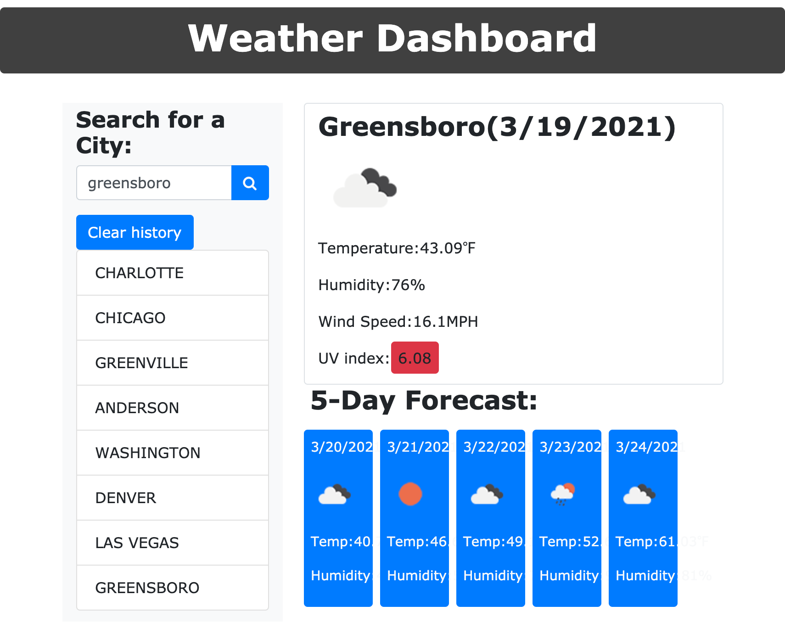

# WeatherDashboard
The Weather Dashboard allows the user to search by city to find the current temperature and humidity of that area. You will be able to see the next 5 days as well. After you have searched for the city you want to see the forecast for your searches are saved in the history. 

# Deployed Website 
https://princessmoss.github.io/WeatherDashboard/

# Github Repository
https://github.com/princessmoss/WeatherDashboard

